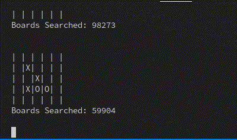

# tictactoe-classic-ai
### A demonstration of classic search algorithms in a game of 5x5 Tic-Tac-Toe

## Gamemodes

The file games.py contains several gamemodes:
1. Player versus a bot making random moves
2. Two bots making random moves
3. Player versus a bot using the minimax algorithm
4. Two bots using the minimax algorithm
5. Player versus a bot using alpha-beta pruning
6. Two bots using alpha-beta pruning

To use one, call the corresponding function at the bottom of games.py

## Rules

The board is five rows by five columns.

Players take turns placing their symbol on the board. 

X goes first.

Any horizontal, vertical, or diagonal row of four symbols wins the game.
